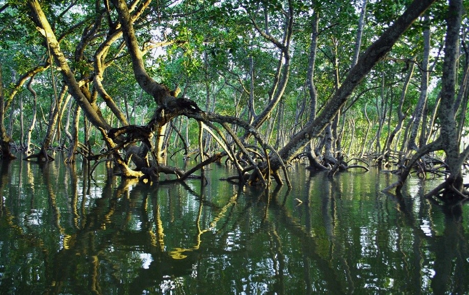
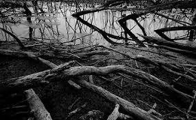
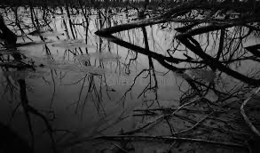
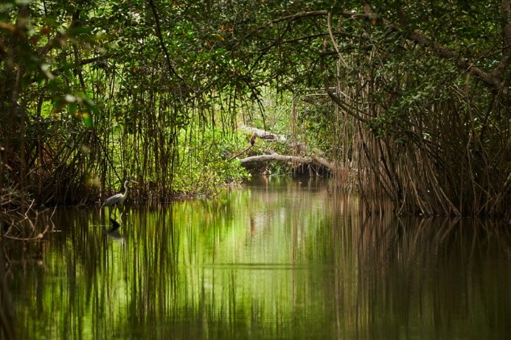

```{r setup, include=FALSE}
options(htmltools.dir.version = FALSE)
library(xaringan)
library(xaringanExtra)
library(knitr)
library(tidyverse)
library(fontawesome)
library(kableExtra)

# Enable panelset
xaringanExtra::use_panelset()
xaringanExtra::use_tile_view()
xaringanExtra::use_clipboard()
xaringanExtra::use_share_again()
xaringanExtra::style_share_again(share_buttons = c("twitter", "linkedin", "pocket"))
```

class: center, middle
background-image: url("pictures/3.jpg")
background-size: cover
background-position: center

# Wetlands – The Kidney of the Earth
## Monitoring and Conservation of Mangrove Wetlands in Greater Bay Area

### CASA0023 Group Project
### Wenkai Song, Yifan Feng, Ruoyun Yu, Huangchen Luo, Ruonan Zhu
### 25/03/2025

---

# Background

.panelset[
.panel[.panel-name[Location]
# The Guangdong-Hong Kong-Macao Greater Bay Area (GBA)
- Located along the southern coast of China
- Includes nine cities in the Pearl River Delta:
  - Guangzhou, Shenzhen, Zhuhai, Foshan, Zhongshan
  - Dongguan, Huizhou, Jiangmen, and Zhaoqing
- Plus two Special Administrative Regions: Hong Kong and Macao
- Total population: 70 million
- One of China's most economically dynamic coastal regions
- Highly susceptible to typhoons, heavy rainfall, and droughts

```{r, echo=FALSE, out.width="60%", fig.align='center'}
knitr::include_graphics("pictures/bharatha-river-with-little-water.jpg")
```
]

.panel[.panel-name[Climate]
# Climate and Mangrove Distribution
- Subtropical climate
- Warm and humid conditions year-round
- Average temperature: 21–23°C
- Annual precipitation: >1500mm
- Extensive mangrove forests in coastal intertidal zones

## Role of Mangroves
- Wave and wind attenuation
- Biodiversity protection
- Seawater purification
- Carbon sequestration
- Key component of wetland ecosystems
- Significant contribution to coastal resilience and environmental sustainability

```{r, echo=FALSE, out.width="60%", fig.align='center'}

```
]
]

---

# Problems

.panelset[
.panel[.panel-name[Area Reduction]
# Wetland Area Reduction

## Human Activity Interference
- Remote sensing monitoring data indicates significant reduction in recent years
- Rapid urbanization, industrialization, and infrastructure development
- Mangrove wetlands reclaimed for:
  - Land use
  - Port construction
  - Agricultural expansion

## Landscape Fragmentation
- Accelerating urbanization along China's southeastern coast
- Exponential increase in mangrove patches
- More fragmented landscape
- Reduced ecological connectivity

```{r, echo=FALSE, out.width="50%", fig.align='center'}

```
]

.panel[.panel-name[Health Decline]
# Declining Health Conditions

## Decline in Vegetation Index
- Remote sensing-based vegetation indices show deterioration
  - NDVI (Normalized Difference Vegetation Index)
  - NDWI (Normalized Difference Water Index)
- Causes:
  - Diseases
  - Tidal variations
  - Human disturbances

## Loss of Biodiversity
- Degradation of mangrove environment
- Decrease in vegetation coverage
- Impact on associated ecosystems:
  - Waterbirds
  - Fish
  - Benthic organisms

```{r, echo=FALSE, out.width="50%", fig.align='center'}

```
]

.panel[.panel-name[Natural Influences]
# Natural Influences

## Rising Sea Levels
- Remote sensing analysis indicates global warming effects
- Rising sea levels intensify:
  - Erosion threats
  - Submersion threats
- Coastal mangroves particularly vulnerable

## Extreme Weather Events
- Long-term remote sensing monitoring reveals:
  - Increased frequency of extreme weather events
  - More typhoons
  - Heavier rainfall
- Accelerated mangrove ecosystem degradation
- Reduced recovery time between events

```{r, echo=FALSE, out.width="50%", fig.align='center'}

```
]

.panel[.panel-name[Policy Issues]
# Insufficient Policy Regulation

## Policy Implementation
- Greater Bay Area has adopted various mangrove restoration measures
- Remote sensing monitoring findings:
  - Slow growth at some restoration sites
  - Low survival rates
  - Need for improved management strategies

## Dynamic Regulation
- Misalignment between remote sensing monitoring data and actual implementation
- Insufficient monitoring capabilities
- Lack of high-precision, real-time wetland and mangrove monitoring tools
- Need for integrated policy frameworks across jurisdictions

```{r, echo=FALSE, out.width="40%", fig.align='center'}
knitr::include_graphics("pictures/logo.png")
```
]
]

---

# Local Policy

.panelset[
.panel[.panel-name[National Foundation]
# National Policy Foundation

## Mangrove Protection and Restoration Action Plan (2020-2025)
- Provides policy foundation for mangrove protection in the Greater Bay Area
- Targets:
  - Maintaining existing mangrove areas
  - Adding 9,000 hectares of new mangroves by 2025
  - Over 80% under protected status

## Wetland Protection Law (2022)
- Implemented in June 2022
- Strengthens legal protection for mangrove wetlands
- Includes mangroves in national important wetlands registry
- Prohibits unauthorized occupation
]

.panel[.panel-name[Provincial System]
# Guangdong Provincial Policy System

## Guangdong Province Mangrove Protection Regulations
- Passed in November 2020
- Implemented in January 2021
- Provides direct legal basis for mangrove protection
- Core province of the Greater Bay Area

## Guangdong Province Wetland Protection Regulations
- Pioneered wetland protection legislation in 2006
- Revised in 2014 and 2018
- Establishes solid legal foundation
- Enables coordinated wetland governance in the Greater Bay Area
]

.panel[.panel-name[Local Innovation]
# Local Policy Innovation

## Shenzhen Special Economic Zone Mangrove Protection Regulations (2018)
- Established a mangrove protection directory
- Implemented tiered management of protection zones
- Serves as a model for other cities in the region

## Guangdong-Hong Kong-Macao Collaborative Protection Mechanism
- Establishing cross-administrative regional collaboration
- Shenzhen-Hong Kong Cooperation Zone actively implementing mangrove restoration projects
- Based on national and provincial policies
- Example: "Qianhai Shenzhen-Hong Kong Cooperation Zone Coastal Recreation Belt Qianwan Area Mangrove Ecological Restoration Project Plan"
]
]

---

# Global Policy

.panelset[
.panel[.panel-name[Ramsar Convention]
# Ramsar Convention on Wetlands of International Importance

- Signed in 1971
- 172 contracting parties worldwide, including China
- The Fourth Ramsar Strategic Plan (2016-2024):
  - Four overarching goals
  - 19 specific targets

## Four Main Goals:
1. Addressing the Drivers of Wetland Loss and Degradation
2. Effectively Conserving and Managing the Ramsar Site Network
3. Wisely Using All Wetlands
4. Enhancing Implementation

[More information](https://www.wwt.org.uk/news-and-stories/blog/why-the-ramsar-convention-on-wetlands-matters-more-than-ever)
]

.panel[.panel-name[UN SDGs]
# Sustainable Development Goals

- Among 169 specific targets in UN SDGs, 75 are related to wetlands

## Goal 6: Ensure availability and sustainable management of water and sanitation for all
- Target 6.6: By 2020, protect and restore water-related ecosystems, including mountains, forests, wetlands, rivers, aquifers and lakes

## Goal 15: Protect, restore and promote sustainable use of terrestrial ecosystems
- Target 15.1: By 2020, ensure the conservation, restoration and sustainable use of terrestrial and inland freshwater ecosystems and their services, in particular forests, wetlands, mountains and drylands, in line with obligations under international agreements

[More information](https://sdgs.un.org/goals)
]

.panel[.panel-name[Other Frameworks]
# Other Global Frameworks

## Sendai Framework for Disaster Risk Reduction 2015-2030
- Four Priorities for Action
- Priority 3: Investing in disaster risk reduction for resilience
- Emphasizes integration of disaster prevention into planning and management
- Highlights importance of wetlands in areas prone to droughts and flooding

## World Cities Report 2020: The Value of Sustainable Urbanization
- Recognizes wetlands as important blue-green infrastructure
- Emphasizes role in regulating ecosystems and enhancing urban resilience

## Transforming Our World: the 2030 Agenda for Sustainable Development
- Highlights importance of wetlands in:
  - Climate adaptation
  - Urban cooling
  - Stormwater management
  - Biodiversity conservation
]
]

---

# Impacts

.panelset[
.panel[.panel-name[Social]
# Social Impacts

## Increased Disaster Risk
- Reduced coastal protection
- Increased risk of flooding and storm surges
- Greater threats to coastal communities

## Loss of Cultural Values
- Loss of cultural heritage
- Diminished opportunities for ecological education

## Public Health Risks
- Reduced ability to purify water and air
- Potential health problems for neighboring populations

## Damage to Community Livelihoods
- People dependent on mangrove resources face sharp income drops
- Loss of traditional ways of life
]

.panel[.panel-name[Economic]
# Economic Impacts

## Loss of Fisheries
- Mangroves are important breeding grounds for fish and crustaceans
- Depletion of fisheries resources
- Significant impact on fisheries income

## Decline in Tourism
- Reduced attractiveness of mangrove ecotourism
- Fewer tourists
- Shrinkage of related services
- Reduced income from tourism

## Rising Cost of Protection
- Weakening of natural coastal protection
- Increased government and enterprise investment needed for:
  - Tidal barriers
  - Seawalls
  - Other protective infrastructure
]

.panel[.panel-name[Environmental]
# Environmental Impacts

## Decrease in Biodiversity
- Damage to habitat of aquatic species, birds, and other wildlife
- Ecosystem imbalance
- Potential loss of endemic species

## Increased Coastal Erosion
- Loss of mangrove sediment stabilization function
- Coastline more susceptible to erosion
- Increased salt water intrusion

## Weakened Carbon Sink Capacity
- Decreased carbon absorption and storage capacity
- Exacerbation of global warming
- Note: Mangroves draw up to five times more carbon than land-based forests
]
]

---

# Methodology Overview

Our comprehensive approach to mangrove wetland monitoring and conservation in the Greater Bay Area incorporates three key methodological components:

1. **Wetland Plant Community Classification**
   - Remote sensing-based classification of mangrove species and communities
   - Multi-source data integration for accurate vegetation mapping

2. **Mangrove Wetland Carbon Storage Monitoring**
   - Assessment of carbon pools in soil and vegetation
   - Monitoring of carbon cycle processes and carbon storage accounting

3. **Wetland Damage and Restoration Identification**
   - Identification of degraded mangrove areas
   - Prioritization of restoration sites based on ecological health assessment

Each methodology employs advanced remote sensing, GIS, and field survey techniques to provide a holistic understanding of mangrove wetland ecosystems.

---

# Methodology 1: Wetland Plant Community Classification

.panelset[
.panel[.panel-name[Data Collection]
## 1. Data Collection and Preprocessing

- **Data Sources**:
  - Sentinel-1 Level-1 GRD SAR images
  - Sentinel-2 MSI Level-2A images
  - 12.5m resolution DEM data from PIE-Engine Cloud Platform

- **Preprocessing Steps**:
  - Mosaicking and clipping
  - Thermal noise removal
  - Orbit correction
  - Filtering
  - Radiometric calibration
  - Doppler terrain correction
  - Speckle reduction
  - Cloud masking
]

.panel[.panel-name[Feature Extraction]
## 2-3. Multi-Source Feature Extraction & Selection

- **Time-series Analysis**:
  - NDVI (Normalized Difference Vegetation Index)
  - IRECI (Inverted Red-Edge Chlorophyll Index)
  - NDWI (Normalized Difference Water Index)
  - Analysis of vegetation phenology and seasonal variations

- **Feature Selection**:
  - Random Forest (RF) model trained on all features
  - Assessment of feature contribution to classification
  - Selection of most discriminative features for analysis
]

.panel[.panel-name[Classification]
## 4-6. Classification & Accuracy Assessment

- **Classification Method**:
  - Random Forest model applied for vegetation community classification

- **Optimization of Results**:
  - Majority filter for noise removal
  - Smoothing of class boundaries
  - Merging of adjacent categories
  - Reclassification of isolated pixel regions

- **Accuracy Measurement**:
  - GPS location of wetland plant types in shallow water areas
  - UAV aerial imagery of wetlands in deeper water areas
  - Field data collection for classification accuracy calculation
]
]

---

# Methodology 2: Mangrove Wetland Carbon Storage Monitoring

.panelset[
.panel[.panel-name[Distribution & Soil]
## 1. Mangrove Distribution Mapping

- **Remote Sensing and Planning**:
  - Multi-temporal satellite imagery (Sentinel-2, Landsat)
  - Vegetation indices and supervised classification
  - Classification of mangrove structures based on height and density
  - Stratified random sampling schemes with tidal factor consideration

## 2. Soil Carbon Pool Assessment

- **Key Carbon Pool Quantification**:
  - Specialized soil samplers for core samples (≥1m deep)
  - Recording of soil depth, compaction rate, and sediment characteristics
  - Laboratory analysis for dry bulk density and organic carbon content
  - Calculation of soil carbon storage per unit area (tC/ha)
  - Analysis of vertical distribution patterns
]

.panel[.panel-name[Vegetation & Cycle]
## 3. Vegetation Carbon Pool Assessment

- **Biomass Calculation**:
  - Measurement of diameter at breast height (DBH) and tree height
  - Allometric equations for biomass calculation
  - Separate assessment of aboveground and belowground biomass
  - Collection of litter and deadwood samples
  - Integration of all biomass components

## 4. Carbon Cycle Process Monitoring

- **Dynamic Assessment**:
  - Permanent sample plots and Surface Elevation Table (SET) devices
  - Greenhouse gas (CO₂, CH₄) flux measurement
  - Analysis of litter decomposition rates and organic carbon output
  - Standardized data recording systems
  - Evaluation of carbon input-output balance
]

.panel[.panel-name[Integration & Model]
## 5. Comprehensive Carbon Storage Accounting

- **Integrated Calculation**:
  - Integration of soil carbon, vegetation carbon, and carbon cycle data
  - Distinguishing contribution proportions of different carbon pools
  - Calculation of spatial variation and temporal changes
  - Assessment of differences among mangrove forest types

## 6. Spatial Model Construction and Application

- **Scale Extension and Decision Support**:
  - Relationship models between field carbon storage and remote sensing
  - Machine learning algorithms for spatial prediction and mapping
  - Carbon storage distribution maps and carbon sink function assessments
  - Analysis of human activities and climate change impacts
  - Decision support tools for conservation and carbon trading
]
]

---

# Methodology 3: Wetland Damage and Restoration Identification

.panelset[
.panel[.panel-name[Data & Identification]
## 1. Data Collection & Preprocessing

- **Remote Sensing & GIS Data**:
  - Landsat, Sentinel-2, ALOS PALSAR imagery
  - DEM, LULC, water quality, heavy metal pollution data
  - Computation of spectral indices (NDVI, NDWI, MSAVI2, EVI)
  - Random Forest for importance evaluation

## 2. Degraded Mangrove Identification

- **Multi-temporal Analysis**:
  - Vegetation and water body changes using NDVI, NDWI trends
  - LUCC analysis to track mangrove conversion
  - Heavy metal concentration evaluation in sediments (Cd, Cr, Zn, Pb)
]

.panel[.panel-name[Assessment & Priority]
## 3. Ecological Health Assessment

- **Soil, Water & Microbial Indicators**:
  - Measurement of SOC, δ13C, NO3⁻-N for ecological function
  - Microbial community analysis (nitrogen-fixing and denitrifying bacteria)
  - Integration of tidal data and pH levels

## 4. Restoration Priority Zone Selection

- **Spatial Analysis**:
  - DEM & Hydrology-based GIS classification
  - Random Forest-based prioritization of high-risk areas
  - TOPSIS ranking of restoration sites
  - Microbial co-occurrence pattern evaluation
]

.panel[.panel-name[Classification & Monitoring]
## 5. Deep Learning for Site Classification

- **APSMnet Classification Model**:
  - ResConv module for local feature extraction
  - Transformer for long-range spatial dependencies
  - CRF for boundary refinement
  - LII & AWLII for defining restoration priority zones

## 6. Long-term Monitoring & Result Evaluation

- **Remote Sensing-Based Monitoring**:
  - Long-term UAV, Landsat, Sentinel-2 surveys
  - Real-time water quality and pollution monitoring
  - Confusion Matrix for classification performance evaluation
  - Overall Accuracy and Kappa coefficient calculation (target >90%)
]
]

---

# Data

[This section is reserved for future data analysis and visualization]

---

# Timeline

```{r, echo=FALSE, fig.align='center', out.width='100%'}
# Creating a timeline visualization
timeline_data <- tibble(
  Phase = c(rep("PHASE 1", 4), rep("PHASE 2", 3), rep("PHASE 3", 4)),
  Topic = c("Initiation", "Data-infrastructure", "Processing and Analytics", "Development", 
            "Processing and Analytics", "Development", "Other", 
            "Development", "Other", "Report and Presentation", "Closure"),
  Start_Week = c(1, 3, 7, 9, 7, 9, 10, 17, 19, 21, 24),
  End_Week = c(2, 6, 16, 16, 16, 18, 18, 22, 23, 23, 24)
)

# Create a simple visualization of the timeline
ggplot(timeline_data, aes(x = Start_Week, xend = End_Week, y = Topic, yend = Topic, color = Phase)) +
  geom_segment(size = 10, alpha = 0.7) +
  scale_color_manual(values = c("PHASE 1" = "#1f78b4", "PHASE 2" = "#33a02c", "PHASE 3" = "#e31a1c")) +
  scale_x_continuous(breaks = seq(0, 24, by = 2), limits = c(0, 25)) +
  labs(title = "Project Implementation Timeline", x = "Week", y = "") +
  theme_minimal() +
  theme(legend.position = "bottom",
        panel.grid.minor = element_blank(),
        panel.grid.major.y = element_blank())
```

---

# Budget

.pull-left[
## Technology
- Hardware and software procurement and maintenance: **80k £**
  - Server, workstation, network security
  - Detection equipment
  - Cloud services, databases, GIS/RS software licenses

## Human Resources
- Core team: **220k £**
  - Project managers
  - Data engineers
  - Geospatial analysts
  - Environmental scientists
  - Software developers
  - UI/UX designers
  - Field researchers
  - Legal advice or government relations
]

.pull-right[
## Administrative
- Office space and operations: **50k £**
  - Office space rental
  - Daily operating costs
  - Transportation travel
  - Office equipment and consumables

## Operations & Maintenance
- Continuous monitoring and data pipeline: **40k £**
  - Administrative costs of small-scale remediation pilot

## Insurance
- Project risk coverage: **20k £**
  - Equipment, personnel, third party liability

## Additional
- Emergency Fund: **60k £**
- Profit / Reserve: **30k £**

**Total Budget: 500k £**
]

---

# Limitations

.panelset[
.panel[.panel-name[Regional Cooperation]
# Regional Cooperation Challenges

## Current Issues
- Wetland reserves within the Greater Bay Area operate independently
- Discrepancies in environmental legislation and wetland management standards among:
  - Mainland China
  - Hong Kong
  - Macao
- Uncoordinated restoration efforts undermining overall conservation effectiveness

## Proposed Solutions
- Develop joint technical guidelines to establish unified standards in key areas:
  - Mangrove restoration
  - Water quality management
  - Biodiversity conservation
- Strengthen technical exchange and knowledge sharing
- Establish cooperative institutions to promote coordinated development
]

.panel[.panel-name[Human Interference]
# High Intensity of Human Interference

## Restrictions
- In urbanized areas, human activities are frequent
- Interference with natural carbon cycling process of mangroves
- Increased difficulty and uncertainty in monitoring

## Mitigation Measures
- Establish buffer zone monitoring points
- Quantify human interference factors
- Develop carbon storage correction models adapted to urbanized environments
- Implement public education programs about mangrove importance
- Create designated access areas to minimize impact
]
]

---

class: center, middle

# Thank You

## Questions?

```{r, echo=FALSE, out.width="30%"}
knitr::include_graphics("pictures/logo.png")
```

### Contact: SEE THE UNSEEN
