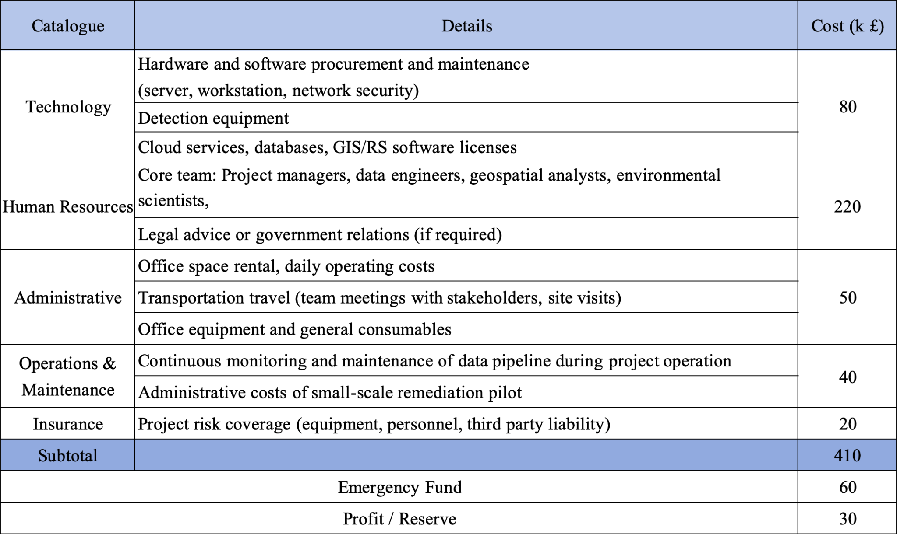
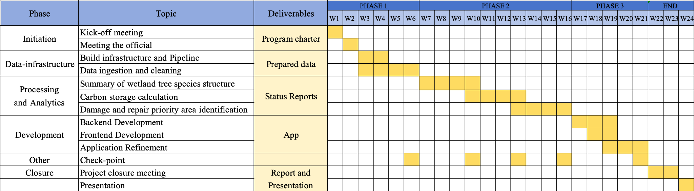

---
output:
  xaringan::moon_reader:
    css: [default, metropolis, metropolis-fonts]
    lib_dir: libs
    nature:
      highlightStyle: github
      highlightLines: true
      countIncrementalSlides: false
      ratio: "16:9"

---

```{r setup, include=FALSE}
options(htmltools.dir.version = FALSE)
library(xaringan)
library(xaringanExtra)
library(knitr)
library(tidyverse)
library(fontawesome)
library(kableExtra)

# Enable panelset
xaringanExtra::use_panelset()
xaringanExtra::use_tile_view()
xaringanExtra::use_clipboard()
xaringanExtra::use_share_again()
xaringanExtra::style_share_again(share_buttons = c("twitter", "linkedin", "pocket"))
```

class: center, middle, inverse
background-image: url(pictures/5.jpg)
background-size: cover
background-position: center

<div class="content-overlay">
<h1>Wetlands – The Kidney of the Earth</h1>
<h2>Monitoring and Conservation of Mangrove Wetlands in Greater Bay Area</h2>
<h3>SEE THE UNSEEN</h3>
<h4>Wenkai Song, Yifan Feng, Ruoyun Yu, Huangchen Luo, Ruonan Zhu</h4>
<h4>25/03/2025</h4>
</div>

<style>
.content-overlay {
  background-color: rgba(0, 0, 0, 0.7);
  padding: 40px;
  border-radius: 10px;
  width: 80%;
  height: 80vh;
  margin: 0 auto;
  display: flex;
  flex-direction: column;
  justify-content: center;
  align-items: center;
  text-align: center;
}

.content-overlay h1 {
  color: #ffffff;
  font-size: 3em;
  margin-bottom: 0.5em;
  text-shadow: 2px 2px 4px rgba(0, 0, 0, 0.5);
  text-align: center;
}

.content-overlay h2 {
  color: #8cc63f;
  font-size: 1.8em;
  margin-bottom: 1em;
  text-align: center;
}

.content-overlay h3,
.content-overlay h4 {
  color: #ffffff;
  text-align: center;
}

.footnote {
  position: absolute;
  bottom: 20px;
  right: 20px;
  color: white;
  font-size: 1.2em;
  background-color: rgba(0, 0, 0, 0.5);
  padding: 5px 10px;
  border-radius: 5px;
}

.remark-slide-content::after {
  content: "";
  position: absolute;
  bottom: 50px;
  right: 20px;
  width: 100px; /* 可根据 logo 大小调整 */
  height: 100px;
  background-image: url("pictures/logo.png");
  background-size: contain;
  background-repeat: no-repeat;
  background-position: center;
  opacity: 0.85; /* 可调节透明度 */
  pointer-events: none; /* 确保点击不受干扰 */
}

</style>

---


# Problems


---
# Local Policy

.panelset[

.panel[.panel-name[🏛️ National Policy Foundation]

<span style="color:#1a237e; font-size:1.2em; font-weight:bold">📜 Mangrove Protection Plan</span>  
China's "Mangrove Protection and Restoration Action Plan (2020-2025)" provides the policy foundation for mangrove protection in the Greater Bay Area. The plan targets maintaining existing mangrove areas while adding 9,000 hectares of new mangroves by 2025, with over 80% under protected status.

<span style="color:#1a237e; font-size:1.2em; font-weight:bold">⚖️ Wetland Protection Law</span>  
The "Wetland Protection Law of the People's Republic of China," implemented in June 2022, strengthens legal protection for mangrove wetlands by including them in the national important wetlands registry and prohibiting unauthorized occupation.

]

.panel[.panel-name[🏢 Provincial Policy System]

<span style="color:#0d47a1; font-size:1.2em; font-weight:bold">🌱 Guangdong Mangrove Regulations</span>  
As the core province of the Greater Bay Area, Guangdong leads in mangrove protection. The "Guangdong Province Mangrove Protection Regulations" were passed in November 2020 and implemented in January 2021, providing direct legal basis for mangrove protection.

<span style="color:#0d47a1; font-size:1.2em; font-weight:bold">💧 Wetland Protection Framework</span>  
Guangdong pioneered wetland protection legislation in 2006 with its "Guangdong Province Wetland Protection Regulations," revised in 2014 and 2018, establishing a solid legal foundation for coordinated wetland governance in the Greater Bay Area.

]

.panel[.panel-name[🏙️ Local Innovation]

<span style="color:#01579b; font-size:1.2em; font-weight:bold">🔍 Shenzhen's Model Approach</span>  
The 2018 revised "Shenzhen Special Economic Zone Mangrove Protection Regulations" established a protection directory and tiered management system, serving as a regional benchmark.

<span style="color:#01579b; font-size:1.2em; font-weight:bold">🌿 City-Level Implementations</span>  
Local municipalities have developed specialized protection zones and restoration initiatives based on the provincial framework, adapting to local ecological conditions.

]

.panel[.panel-name[🤝 Regional Collaboration]

<span style="color:#006064; font-size:1.2em; font-weight:bold">🌉 Cross-Border Mechanisms</span>  
The Greater Bay Area is establishing collaborative protection frameworks across administrative boundaries for comprehensive mangrove ecosystem management.

<span style="color:#006064; font-size:1.2em; font-weight:bold">🌊 Joint Restoration Projects</span>  
The Shenzhen-Hong Kong Cooperation Zone is implementing mangrove restoration initiatives like the "Qianhai Coastal Recreation Belt Qianwan Area Mangrove Ecological Restoration Project Plan."

]

]


---
# Global Policy

.panelset[

.panel[.panel-name[Ramsar Convention]
<span style="color:#2e7d32; font-size:1.2em; font-weight:bold">📜 Ramsar Convention on Wetlands</span>  

- Signed in 1971  
- 172 contracting parties (including China)  
- Fourth Strategic Plan (2016-2024):  
  - 4 overarching goals 
  - Goal 1:   Addressing the Drivers of Wetland Loss and Degradation
  - Goal 2:   Effectively Conserving and Managing the Ramsar Site Network
  - Goal 3:   Wisely Using All Wetlands
  - Goal 4:   Enhancing lmplementation
<div style="display: flex; flex-direction: column; align-items: flex-end; position: relative; top: -300px;">
  
  
</div>

[Source:Ramsar Convention](https://www.ramsar.org)
]

.panel[.panel-name[UN SDGs]
<span style="color:#33691e; font-size:1.2em; font-weight:bold">🌍 Sustainable Development Goals</span>  

- 75/169 SDG targets relate to wetlands  

- Goal 6: Clean water and sanitation
  - Target 6.6: Protect/restore water-related ecosystems with wetland focus by 2020

- Goal 15: Life on land 
  - Target 15.1: Prioritize wetland conservation & restoration by 2020

<span style="color:#1b5e20; font-size:1.2em; font-weight:bold">🌍 2030 Agenda for Sustainable Development :</span>  
- Wetlands' roles in:  
  - Climate adaptation  
  - Urban cooling  
  - Biodiversity  
  
<div style="display: flex; flex-direction: column; align-items: flex-end; position: relative; top: -500px;">
  
  
[Source:United Nations](https://sdgs.un.org/goals)
]
</div>


.panel[.panel-name[Other Frameworks]

<span style="color:#1b5e20; font-size:1.2em; font-weight:bold">🌪️ Sendai Framework (2015-2030):</span>  
- Priority 3: Invest in disaster resilience  
  - Integrate wetlands in flood management  

<span style="color:#1b5e20; font-size:1em; font-weight:bold">🏙️ World Cities Report 2020:</span>  
- Recognize wetlands as blue-green infrastructure  

  
]
]


---

# Impacts of Reduced Mangrove Wetlands

.panelset[

.panel[.panel-name[🌍 Social Impacts]

<span style="color:#2e7d32; font-size:1.2em; font-weight:bold">🌊 Increased disaster risk</span>  
Reduced coastal protection increases the risk of flooding, storm surges, and threats to coastal communities.  

<span style="color:#2e7d32; font-size:1.2em; font-weight:bold">🏺 Loss of cultural values</span>  
Loss of cultural heritage and diminished opportunities for ecological education.  

<span style="color:#2e7d32; font-size:1.2em; font-weight:bold">🧪 Public health risks</span>  
Reduced mangrove filtration capacity may lead to poorer air and water quality, causing health problems for nearby populations.  

<span style="color:#2e7d32; font-size:1.2em; font-weight:bold">💸 Damage to community livelihoods</span>  
People depending on mangrove resources for income may experience significant economic loss.

]

.panel[.panel-name[💰 Economic Impacts]

<span style="color:#33691e; font-size:1.2em; font-weight:bold">🐟 Loss of fisheries</span>  
Mangroves are breeding grounds for fish and crustaceans. Their decline leads to reduced fishery income.  

<span style="color:#33691e; font-size:1.2em; font-weight:bold">🏝️ Decline in tourism</span>  
Reduced appeal of ecotourism, fewer visitors, shrinking services, and lower tourism revenue.  

<span style="color:#33691e; font-size:1.2em; font-weight:bold">🛡️ Rising protection costs</span>  
Weakened natural defense requires more investment in coastal infrastructure like seawalls and barriers.

]

.panel[.panel-name[🌱 Environmental Impacts]

<span style="color:#1b5e20; font-size:1.2em; font-weight:bold">🐦 Decrease in biodiversity</span>  
Degraded mangrove habitat threatens birds, fish, and aquatic species, disturbing ecosystem balance.  

<span style="color:#1b5e20; font-size:1.2em; font-weight:bold">🌊 Increased coastal erosion</span>  
Loss of sediment stabilization function exposes shorelines to erosion and saltwater intrusion.  

<span style="color:#1b5e20; font-size:1.2em; font-weight:bold">🔥 Weakened carbon sink</span>  
Mangroves absorb 3–5× more carbon than land forests. Their loss accelerates global warming.

]

]

---

# Methodology Overview

Our comprehensive approach to mangrove wetland monitoring and conservation in the Greater Bay Area incorporates three key methodological components:

1. **Wetland Plant Community Classification**
   - Remote sensing-based classification of mangrove species and communities
   - Multi-source data integration for accurate vegetation mapping

2. **Mangrove Wetland Carbon Storage Monitoring**
   - Assessment of carbon pools in soil and vegetation
   - Monitoring of carbon cycle processes and carbon storage accounting

3. **Wetland Damage and Restoration Identification**
   - Identification of degraded mangrove areas
   - Prioritization of restoration sites based on ecological health assessment

Each methodology employs advanced remote sensing, GIS, and field survey techniques to provide a holistic understanding of mangrove wetland ecosystems.


---
class: 

# 1 wetland plant community classification

<style>
.grid-container {
  display: grid;
  grid-template-columns: repeat(3, 1fr);
  grid-gap: 15px;
  margin: 20px 15px;
}

.box {
  border-radius: 8px;
  padding: 15px;
  box-shadow: 0 2px 4px rgba(0,0,0,0.1);
}

.box-title {
  font-size: 18px;
  font-weight: bold;
  margin-top: 0;
  margin-bottom: 8px;
  border-bottom: 1px solid rgba(0,0,0,0.2);
  padding-bottom: 5px;
}

.box-subtitle {
  font-size: 14px;
  font-style: italic;
  margin-bottom: 8px;
  color: #444;
}

.box ul {
  margin: 0;
  padding-left: 20px;
}

.box li {
  font-size: 14px;
  margin-bottom: 5px;
  line-height: 1.3;
}

.box1 { background-color: rgba(255, 220, 220, 0.7); }
.box2 { background-color: rgba(255, 235, 205, 0.7); }
.box3 { background-color: rgba(255, 248, 205, 0.7); }
.box4 { background-color: rgba(220, 255, 220, 0.7); }
.box5 { background-color: rgba(220, 235, 255, 0.7); }
.box6 { background-color: rgba(245, 220, 245, 0.7); }
</style>

<div class="grid-container">
  <div class="box box1">
    <div class="box-title">1. Data Collection and Preprocessing</div>
    <ul>
      <li>Obtain Sentinel-1 Level-1 GRD SAR images, Sentinel-2 MSI Level-2A images, and 12.5m resolution DEM data from the PIE-Engine Cloud Platform</li>
      <li>Mosaicking and clipping</li>
      <li>Thermal noise removal, orbit correction, filtering, radiometric calibration, Doppler terrain correction, and speckle reduction</li>
      <li>Cloud masking</li>
    </ul>
  </div>
  
  <div class="box box2">
    <div class="box-title">2. Multi-Source Feature Extraction</div>
    <ul>
      <li>Time-series stacks of NDVI, IRECI, and NDWI were derived from preprocessed Sentinel-2 images to analyze vegetation phenology and seasonal variations</li>
    </ul>
  </div>
  
  <div class="box box3">
    <div class="box-title">3. Feature Selection</div>
    <ul>
      <li> A Random Forest (RF) model was trained on all features to assess their contribution to classification, selecting the most discriminative ones for analysis</li>
    </ul>
  </div>
  
  <div class="box box4">
    <div class="box-title">4. Classification</div>
    <ul>
      <li>A Random Forest model was applied for vegetation community classification</li>
    </ul>
  </div>
  
  <div class="box box5">
    <div class="box-title">5. Optimization of Classification Results</div>
    <ul>
      <li>A majority filter was used to remove noise, smooth class boundaries, merge adjacent categories, and reclassify isolated pixel regions</li>
    </ul>
  </div>
  
  <div class="box box6">
    <div class="box-title">6. Accuracy measurement</div>
    <ul>
      <li>GPS was used to locate the distribution of wetland plant types in shallow water areas, while UAVs were employed to capture aerial imagery of wetlands in deeper water areas, providing field data for the calculation of classification accuracy</li>
    </ul>
  </div>
</div>

<div class="footer">Wetlands — The Kidney of the Earth</div>

---
class: 

# 2 Mangrove Wetland Carbon Storage Monitoring

<style>
.grid-container {
  display: grid;
  grid-template-columns: repeat(3, 1fr);
  grid-gap: 15px;
  margin: 20px 15px;
}

.box {
  border-radius: 8px;
  padding: 15px;
  box-shadow: 0 2px 4px rgba(0,0,0,0.1);
}

.box-title {
  font-size: 18px;
  font-weight: bold;
  margin-top: 0;
  margin-bottom: 8px;
  border-bottom: 1px solid rgba(0,0,0,0.2);
  padding-bottom: 5px;
}

.box-subtitle {
  font-size: 14px;
  font-style: italic;
  margin-bottom: 8px;
  color: #444;
}

.box ul {
  margin: 0;
  padding-left: 20px;
}

.box li {
  font-size: 14px;
  margin-bottom: 5px;
  line-height: 1.3;
}

.box1 { background-color: rgba(255, 220, 220, 0.7); }
.box2 { background-color: rgba(255, 235, 205, 0.7); }
.box3 { background-color: rgba(255, 248, 205, 0.7); }
.box4 { background-color: rgba(220, 255, 220, 0.7); }
.box5 { background-color: rgba(220, 235, 255, 0.7); }
.box6 { background-color: rgba(245, 220, 245, 0.7); }
</style>

<div class="grid-container">
  <div class="box box1">
    <div class="box-title">1. Mangrove Distribution Mapping</div>
    <div class="box-subtitle">Remote Sensing and Planning:</div>
    <ul>
      <li>Acquire and preprocess satellite imagery</li>
      <li>Identify mangrove using vegetation indices</li>
      <li>Classify mangrove structures</li>
      <li>Design stratified random sampling</li>
      <li>Consider tidal factors and accessibility</li>
    </ul>
  </div>
  
  <div class="box box2">
    <div class="box-title">2. Soil Carbon Pool Assessment</div>
    <div class="box-subtitle">Carbon Pool Quantification:</div>
    <ul>
      <li>Collect soil core samples (1m+ deep)</li>
      <li>Record soil characteristics</li>
      <li>Determine bulk density and carbon content</li>
      <li>Calculate soil carbon storage (tC/ha)</li>
      <li>Analyze vertical carbon distribution</li>
    </ul>
  </div>
  
  <div class="box box3">
    <div class="box-title">3. Vegetation Carbon Pool Assessment</div>
    <div class="box-subtitle">Biomass Calculation:</div>
    <ul>
      <li>Measure DBH and tree height</li>
      <li>Apply allometric equations</li>
      <li>Assess above/belowground biomass</li>
      <li>Collect litter and deadwood samples</li>
      <li>Calculate vegetation carbon storage</li>
    </ul>
  </div>
  
  <div class="box box4">
    <div class="box-title">4. Carbon Cycle Monitoring</div>
    <div class="box-subtitle">Dynamic Assessment:</div>
    <ul>
      <li>Establish permanent sample plots</li>
      <li>Measure greenhouse gas flux</li>
      <li>Analyze decomposition rates</li>
      <li>Implement data quality control</li>
      <li>Evaluate carbon input/output balance</li>
    </ul>
  </div>
  
  <div class="box box5">
    <div class="box-title">5. Comprehensive Carbon Storage</div>
    <div class="box-subtitle">Integrated Calculation:</div>
    <ul>
      <li>Integrate all carbon pool data</li>
      <li>Distinguish carbon pool proportions</li>
      <li>Calculate spatial-temporal changes</li>
      <li>Assess differences between forest types</li>
    </ul>
  </div>
  
  <div class="box box6">
    <div class="box-title">6. Spatial Model Construction</div>
    <div class="box-subtitle">Scale Extension:</div>
    <ul>
      <li>Link field data with remote sensing</li>
      <li>Apply machine learning algorithms</li>
      <li>Generate carbon storage maps</li>
      <li>Analyze human and climate impacts</li>
      <li>Develop conservation support tools</li>
    </ul>
  </div>
</div>

<div class="footer">Wetlands — The Kidney of the Earth</div>


---

# Project Data Overview

.pull-left[
1. **Remote Sensing & GIS Data**  
   - Sentinel-1 Level-1 GRD SAR imagery  
   - Sentinel-2 MSI Level-2A imagery  
   - Landsat imagery  
   - ALOS PALSAR imagery  
   - DEM (12.5m resolution) and LULC data  

<br>

3. **Hydro & Environmental Data**  
   - Water and tidal records  
]

.pull-right[ 
2. **Field Data**  
   - GPS positioning data  
   - UAV aerial imagery  
   - Tree measurement data (DBH, tree height)  
   - Soil core sampling records  
   - Greenhouse gas measurement data (CO₂, CH₄)  
   - Water quality data (pH, NH₄⁺-N, NO₃⁻-N)  
   - Heavy metal pollution data (Cd, Cr, Zn, Pb)  
]


---

# Budget 

```{r, echo=FALSE, out.width='80%', fig.align='center'}

```

---


# Project Timeline

```{r, echo=FALSE, out.width='95%', fig.align='center'}

```

---


# Limitations

.pull-left[
### 1. Regional Co-operation

**Wetland reserves within the Greater Bay Area operate independently. **

Discrepancies in environmental legislation and wetland management standards among Mainland China, Hong Kong, and Macao result in uncoordinated restoration efforts, reducing overall conservation effectiveness.

*Possible Solution:*

Technical guidelines should be jointly developed to establish unified standards in key areas such as mangrove restoration, water quality management, and biodiversity conservation.  
Strengthening technical exchange and knowledge sharing, as well as establishing cooperative institutions, will promote more coordinated development.
]

.pull-right[

### 2. High Intensity of Human Interference

In urbanized areas, frequent human activities interfere with the natural carbon cycling process of mangroves, increasing the difficulty and uncertainty of monitoring.

*Mitigation Measures:*

Establish buffer zone monitoring points, quantify human interference factors, and develop carbon storage correction models adapted to the urbanized environment.
]

---
