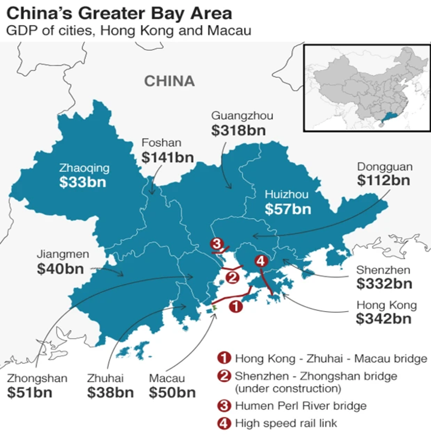
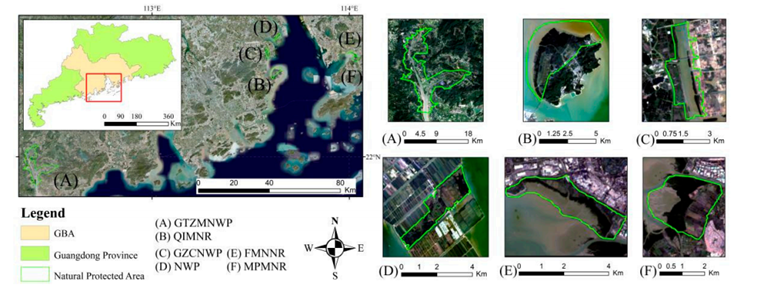

---
output:
  xaringan::moon_reader:
    css: [default]
    nature:
      highlightStyle: github
      highlightLines: true
      countIncrementalSlides: false
---

1 Overview of the Greater Bay Area (GBA)

  

    <ul>
      <li>📍 <strong>Location:</strong> Southern coast of China, Pearl River Delta</li>
      <li>🏙️ <strong>Constituents:</strong> 9 Mainland cities:
        Guangzhou, Shenzhen, Zhuhai, Foshan, Zhongshan, Dongguan, Huizhou, Jiangmen, Zhaoqing</li>
      <li>🎌 <strong>Special Regions:</strong> Hong Kong and Macao (SARs)</li>
      <li>👥 <strong>Total Population:</strong> ~70 million</li>
      <li>💰 <strong>Economic Importance:</strong> One of China’s most dynamic & innovative economic zones</li>
      <li>🌪️ <strong>Climate Vulnerabilities:</strong> Frequent typhoons, heavy rainfall, urban flooding, and droughts</li>
    </ul>
  

  

    
  

Wetlands — The Kidney of the Earth

---

2 Mangroves and Climate in the Greater Bay Area

  

    <ul>
      <li>🌤️ <strong>Climate:</strong> Subtropical and humid year-round</li>
      <li>🌡️ <strong>Avg. Temperature:</strong> 21–23°C</li>
      <li>🌧️ <strong>Annual Rainfall:</strong> Over 1500 mm</li>
      <li>🪸 <strong>Mangrove Habitat:</strong> Coastal intertidal zones</li>
    </ul>
  

  

    <ul>
      <li>🌿 <strong>Ecological Functions of Mangroves:</strong>
        <ul>
          <li>Reduce wave energy & wind impact</li>
          <li>Stabilize shorelines & prevent erosion</li>
          <li>Enhance biodiversity & nursery habitats</li>
          <li>Purify seawater & trap pollutants</li>
          <li>Sequester large amounts of carbon</li>
        </ul>
      </li>
    </ul>
  

Wetlands — The Kidney of the Earth

