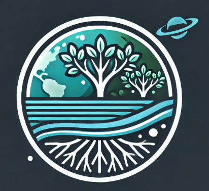

---
output:
  xaringan::moon_reader:
    css: [default]
    nature:
      highlightStyle: github
      highlightLines: true
      countIncrementalSlides: false
---

3 Mangrove Restoration Site Identification

  

    
1. Data Collection & Preprocessing

    
Remote Sensing & Indices:

    <ul>
      <li>Landsat, Sentinel-2, ALOS PALSAR imagery</li>
      <li>DEM, LULC, water quality, pollution data</li>
      <li>NDVI, NDWI, MSAVI2, EVI computation</li>
      <li>Variable importance via Random Forest</li>
    </ul>
  

  

    
2. Degraded Mangrove Identification

    
Multi-temporal & Pollution Analysis:

    <ul>
      <li>NDVI/NDWI trend analysis</li>
      <li>LUCC change detection</li>
      <li>Heavy metal (Cd, Cr, Zn, Pb) in sediments</li>
    </ul>
  

  

    
3. Ecological Health Assessment

    
Soil, Water & Microbes:

    <ul>
      <li>Measure SOC, δ13C, NO3⁻-N</li>
      <li>Analyze N-fixing & denitrifying bacteria</li>
      <li>Integrate tidal & pH indicators</li>
    </ul>
  

  

    
4. Restoration Priority Zoning

    
GIS & Model Ranking:

    <ul>
      <li>DEM & hydrology-based classification</li>
      <li>B1–B12 bands + NDVI time series</li>
      <li>TOPSIS multi-criteria ranking</li>
      <li>Microbial network resilience analysis</li>
    </ul>
  

  

    
5. Deep Learning Classification

    
APSMnet Model:

    <ul>
      <li>ResConv for local feature extraction</li>
      <li>Transformer for spatial dependency</li>
      <li>CRF for boundary refinement</li>
      <li>Map LII & AWLII restoration zones</li>
    </ul>
  

  

    
6. Monitoring & Evaluation

    
Remote Sensing & Accuracy:

    <ul>
      <li>UAV, Landsat, Sentinel-2 surveys</li>
      <li>Sensor-based pH, NH4⁺-N, NO3⁻-N monitoring</li>
      <li>Confusion Matrix, OA, Kappa (>90%)</li>
    </ul>
  

Wetlands — The Kidney of the Earth

<!-- 添加右下角图标 -->

