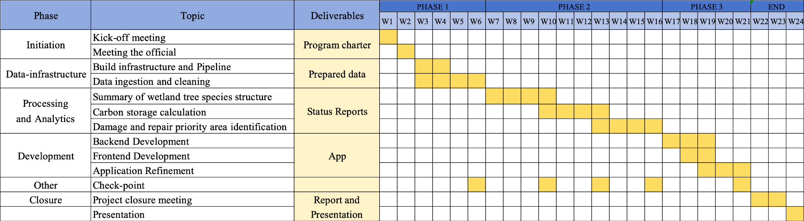

---
output:
  xaringan::moon_reader:
    css: [default, metropolis, metropolis-fonts]
    lib_dir: libs
    nature:
      highlightStyle: github
      highlightLines: true
      countIncrementalSlides: false
      ratio: "16:9"
---

```{r setup, include=FALSE}
options(htmltools.dir.version = FALSE)
library(xaringan)
library(xaringanExtra)
library(knitr)
library(tidyverse)
library(fontawesome)
library(kableExtra)

# Enable panelset
xaringanExtra::use_panelset()
xaringanExtra::use_tile_view()
xaringanExtra::use_clipboard()
xaringanExtra::use_share_again()
xaringanExtra::style_share_again(share_buttons = c("twitter", "linkedin", "pocket"))
```

class: center, middle, inverse
background-image: url(pictures/5.jpg)
background-size: cover
background-position: center

<div class="content-overlay">
<h1>Wetlands – The Kidney of the Earth</h1>
<h2>Monitoring and Conservation of Mangrove Wetlands in Greater Bay Area</h2>
<h3>SEE THE UNSEEN</h3>
<h4>Wenkai Song, Yifan Feng, Ruoyun Yu, Huangchen Luo, Ruonan Zhu</h4>
<h4>25/03/2025</h4>
</div>

<style>
.content-overlay {
  background-color: rgba(0, 0, 0, 0.7);
  padding: 40px;
  border-radius: 10px;
  width: 80%;
  height: 80vh;
  margin: 0 auto;
  display: flex;
  flex-direction: column;
  justify-content: center;
  align-items: center;
  text-align: center;
}

.content-overlay h1 {
  color: #ffffff;
  font-size: 3em;
  margin-bottom: 0.5em;
  text-shadow: 2px 2px 4px rgba(0, 0, 0, 0.5);
  text-align: center;
}

.content-overlay h2 {
  color: #8cc63f;
  font-size: 1.8em;
  margin-bottom: 1em;
  text-align: center;
}

.content-overlay h3,
.content-overlay h4 {
  color: #ffffff;
  text-align: center;
}

.footnote {
  position: absolute;
  bottom: 20px;
  right: 20px;
  color: white;
  font-size: 1.2em;
  background-color: rgba(0, 0, 0, 0.5);
  padding: 5px 10px;
  border-radius: 5px;
}

.remark-slide-content::after {
  content: "";
  position: absolute;
  bottom: 50px;
  right: 20px;
  width: 100px; /* 可根据 logo 大小调整 */
  height: 100px;
  background-image: url("pictures/logo.png");
  background-size: contain;
  background-repeat: no-repeat;
  background-position: center;
  opacity: 0.85; /* 可调节透明度 */
  pointer-events: none; /* 确保点击不受干扰 */
}

</style>


---

# Impacts of Reduced Mangrove Wetlands

.panelset[

.panel[.panel-name[🌍 Social Impacts]

<span style="color:#2e7d32; font-size:1.2em; font-weight:bold">🌊 Increased disaster risk</span>  
Reduced coastal protection increases the risk of flooding, storm surges, and threats to coastal communities.  

<span style="color:#2e7d32; font-size:1.2em; font-weight:bold">🏺 Loss of cultural values</span>  
Loss of cultural heritage and diminished opportunities for ecological education.  

<span style="color:#2e7d32; font-size:1.2em; font-weight:bold">🧪 Public health risks</span>  
Reduced mangrove filtration capacity may lead to poorer air and water quality, causing health problems for nearby populations.  

<span style="color:#2e7d32; font-size:1.2em; font-weight:bold">💸 Damage to community livelihoods</span>  
People depending on mangrove resources for income may experience significant economic loss.

]

.panel[.panel-name[💰 Economic Impacts]

<span style="color:#33691e; font-size:1.2em; font-weight:bold">🐟 Loss of fisheries</span>  
Mangroves are breeding grounds for fish and crustaceans. Their decline leads to reduced fishery income.  

<span style="color:#33691e; font-size:1.2em; font-weight:bold">🏝️ Decline in tourism</span>  
Reduced appeal of ecotourism, fewer visitors, shrinking services, and lower tourism revenue.  

<span style="color:#33691e; font-size:1.2em; font-weight:bold">🛡️ Rising protection costs</span>  
Weakened natural defense requires more investment in coastal infrastructure like seawalls and barriers.

]

.panel[.panel-name[🌱 Environmental Impacts]

<span style="color:#1b5e20; font-size:1.2em; font-weight:bold">🐦 Decrease in biodiversity</span>  
Degraded mangrove habitat threatens birds, fish, and aquatic species, disturbing ecosystem balance.  

<span style="color:#1b5e20; font-size:1.2em; font-weight:bold">🌊 Increased coastal erosion</span>  
Loss of sediment stabilization function exposes shorelines to erosion and saltwater intrusion.  

<span style="color:#1b5e20; font-size:1.2em; font-weight:bold">🔥 Weakened carbon sink</span>  
Mangroves absorb 3–5× more carbon than land forests. Their loss accelerates global warming.

]

]

---

# Budget 

```{r, echo=FALSE, out.width='80%', fig.align='center'}
knitr::include_graphics("pictures/budget.png")
```

---


# Project Timeline

```{r, echo=FALSE, out.width='95%', fig.align='center'}

```
---


# Limitations

.pull-left[
### 1. Regional Co-operation

**Wetland reserves within the Greater Bay Area operate independently. **

Discrepancies in environmental legislation and wetland management standards among Mainland China, Hong Kong, and Macao result in uncoordinated restoration efforts, reducing overall conservation effectiveness.

*Possible Solution:*

Technical guidelines should be jointly developed to establish unified standards in key areas such as mangrove restoration, water quality management, and biodiversity conservation.  
Strengthening technical exchange and knowledge sharing, as well as establishing cooperative institutions, will promote more coordinated development.
]

.pull-right[

### 2. High Intensity of Human Interference

In urbanized areas, frequent human activities interfere with the natural carbon cycling process of mangroves, increasing the difficulty and uncertainty of monitoring.

*Mitigation Measures:*

Establish buffer zone monitoring points, quantify human interference factors, and develop carbon storage correction models adapted to the urbanized environment.
]

---
